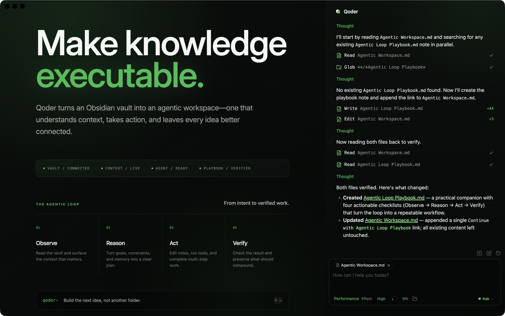

# Qoderian

[English](README.md) | 中文

一个把 [Qoder CLI](https://qoder.com)（`qodercli`）嵌入 Obsidian 仓库的插件。你的仓库就是智能体的工作目录——文件读写、检索、bash 和多步工作流开箱即用。



## 功能与用法

从左侧功能区图标或命令面板（`Open Qoderian`）打开聊天侧栏。输入消息后按 **Enter**，qodercli 会以流式方式把回复送回面板。一切和你熟悉的 qodercli 一样——它可以读取、写入、编辑、搜索仓库中的文件。

**`@mention`** — 输入 `@` 可把仓库笔记、当前选区或外部目录加入上下文。附件会以可移除的标签形式显示在输入框上方。

**Inline Edit** — 在笔记中选中文字并运行内联编辑命令，可就地改写，接受前先给出 diff 预览。

**Slash Commands & Skills** — 输入 `/` 使用内置和项目级命令。Skills、agents、hooks 读取自同一套 Qoder CLI 项目文件，终端里能用的这里也能用。

**Permission Modes** — 在聊天工具栏直接选择 Ask、Allow edits、Auto、Plan 或 YOLO。`Ask` 对每个敏感操作逐一确认；`Allow edits` 自动批准文件编辑；`Auto` 由 SDK 自行决定、不弹确认；`Plan` 把智能体限制为只读探索；`YOLO` 跳过逐次确认。这些模式直接映射到 Qoder SDK 的权限策略，没有插件自造的命令规则。

**Instruction Mode（`#`）** — 空输入框中按 `#` 编写自定义指令，指令会先经过润色再应用。

**Bash Mode（`!`）** — 空输入框中按 `!` 可直接在仓库目录运行 shell 命令。

**模型与强度控制** — 在输入框下方选择模型，并在按模型划分的编辑器中调节推理强度，还可以查看 Qoder Agent SDK 上报的上下文用量。

**MCP Servers** — 通过 Model Context Protocol（stdio、SSE、HTTP）连接外部工具，在应用内配置。

**多标签与会话** — 多个聊天标签，各自保有历史，另支持续接（resume）、分叉（fork）与回退（rewind）。

**Subagents** — 嵌套的智能体运行会分组内联渲染，方便跟进每个子智能体做了什么。

### 模型

| 模型 | 说明 |
|-------|-------------|
| `auto` | 自动选择模型（默认） |
| `ultimate` | 最强能力 |
| `performance` | 性能均衡 |
| `efficient` | 快速且性价比高 |
| `lite` | 轻量快速 |

自适应思考模型接受 `Low`、`Med`、`High`、`XHigh`、`Max` 五档强度，通过模型选择器内的编辑器按模型配置。选择器消费 Qoder Agent SDK 返回的运行时目录，包括在 qodercli 中配置的模型。

## 运行要求

- 已安装 [Qoder CLI](https://qoder.com)（`qodercli`），已登录，且在 PATH 中可用
- Obsidian v1.7.2+
- 仅桌面端（macOS、Linux、Windows）

验证 CLI 可达：

```bash
qodercli --version
```

## 安装

### 从 Obsidian 社区插件安装（上架后推荐）

1. 打开 Obsidian → 设置 → 第三方插件 → 浏览
2. 搜索 "Qoderian" 并点击安装
3. 启用插件

### 从 GitHub Release 安装

1. 从 [latest release](../../releases/latest) 下载 `main.js`、`manifest.json`、`styles.css`
2. 在仓库的插件目录下创建 `qoderian` 文件夹：
   ```
   /path/to/vault/.obsidian/plugins/qoderian/
   ```
3. 把下载的文件复制进该文件夹
4. 在 Obsidian 中启用插件：设置 → 第三方插件 → 关闭受限模式 → 启用 "Qoderian"

### 从源码安装

1. 把仓库克隆到仓库的插件目录：
   ```bash
   cd /path/to/vault/.obsidian/plugins
   git clone <repository-url> qoderian
   cd qoderian
   ```
2. 安装依赖并构建：
   ```bash
   npm ci
   npm run build
   ```
   这会在 `manifest.json` 旁边生成 `main.js` 和 `styles.css`，Obsidian 正是从那里加载它们。
3. 在 Obsidian 中启用插件

### 开发

```bash
# 监视模式；改动后自动重新构建
npm run dev

# 生产构建
npm run build

# 检查
npm run typecheck
npm run lint
npm run test
npm run test:coverage
npm run audit:prod
```

把 `.env.local.example` 复制为 `.env.local` 并设置 `OBSIDIAN_VAULT`，开发构建会自动拷贝进本地仓库。

涉及 SDK 或 qodercli 生命周期的改动，请对已登录的本地 CLI 跑只做初始化的冒烟检查。它遵循官方的模型选择示例：

```bash
npm run smoke:qoder
# qodercli 不在 PATH 时可选：
QODER_CLI_PATH=/absolute/path/to/qodercli npm run smoke:qoder
```

冒烟检查会启动一个空闲 Query，读取运行时模型元数据，然后不发送任何用户回合地关闭 Query。

## 设置

打开 **设置 → Qoderian**：

| 设置项 | 说明 |
|---------|-------------|
| **CLI path** | `qodercli` 可执行文件路径（默认自动探测） |
| **MCP servers** | 外部 MCP 工具服务器（stdio / SSE / HTTP） |

## 隐私与数据使用

- **发送到 Qoder**：你的输入、附件笔记与图片、工具结果会通过 `qodercli` 发送到 Qoder 服务。这些数据的处理方式受 Qoder 的服务条款与隐私政策约束。
- **本地存储**：Qoderian 的设置与会话元数据存放在 `vault/.qoderian/`；Qoder CLI 的项目文件、命令、skills、agents 与 MCP 配置存放在 `vault/.qoder/`；原生转录由 qodercli 自行管理。Obsidian 会把打开的标签布局保存在 `.obsidian/plugins/qoderian/data.json`。
- **凭据**：Qoderian 从不捆绑、生成或索要 Qoder API key——登录由本地 `qodercli` 管理，也绝不会被复制进仓库。密钥可能出现在存于 `.qoder/mcp.json` 的第三方 MCP 配置中；切勿把该文件提交或同步到不可信的地方。
- **环境变量**：qodercli 子进程继承 Obsidian 的进程环境。Qoderian 不会在仓库中持久化环境变量覆盖。
- **文件与 shell 访问**：取决于权限模式与确认，qodercli 可能读取、创建、修改、删除文件并运行 shell 命令。启用 `YOLO` 前请了解风险，并为重要仓库保留备份或版本控制。
- **仓库之外的触达**：外部上下文与 MCP 服务器可能按各自服务的规则访问仓库之外的文件或第三方网络服务。
- **后台活动**：Qoderian 自身不跑任何遥测。网络活动仅限于 qodercli 和你配置的 MCP 端点。

提交 issue 前请打码设置、日志与截图。

## 故障排查

### qodercli not found

如果看到 `spawn qodercli ENOENT`，说明插件没能自动探测到你的安装。这在使用 Node 版本管理器（nvm、fnm、volta）时很常见，因为 Obsidian 这类 GUI 应用不会继承 shell 的 PATH。

先保持 CLI path 为空，让自动探测跑一遍。若仍失败，找到路径并在 **设置 → CLI path** 中填入：

| 平台 | 命令 | 示例路径 |
|----------|---------|--------------|
| macOS / Linux | `which qodercli` | `/Users/you/.local/bin/qodercli` |
| Windows | `where.exe qodercli` | `C:\Users\you\AppData\Local\qodercli\qodercli.exe` |
| npm 安装 | `npm root -g` | `{root}\@qoder-ai\qodercli\cli.js` |

Windows 上优先使用原生可执行文件，而不是 `.cmd` 或 `.ps1` 包装器。

### CLI 与 Node.js 不在同一目录

如果 CLI 是通过 npm 安装的，检查 `qodercli` 与 `node` 是否解析到同一位置：

```bash
dirname $(which qodercli)
dirname $(which node)
```

若两者不同，Obsidian 可能找得到 CLI 却找不到它需要的 Node.js 运行时。优先使用原生 qodercli 二进制，或把 Node.js 安装到桌面应用可见的标准位置，然后重启 Obsidian。

### 进程退出码 42

通常意味着参数不兼容。Qoderian 会把 SDK 提供的参数过滤并转换成 qodercli 兼容的形式；如果仍然出现，请附上错误日志开 issue。

### 启用插件后没有任何反应

1. 确认 Obsidian 为 1.7.2 或更高版本
2. 确认受限模式已关闭（设置 → 第三方插件）
3. 重启 Obsidian
4. 打开开发者控制台（`Ctrl+Shift+I` / `Cmd+Option+I`）检查报错

## 架构

```
src/
├── main.ts                   # 插件入口
├── app/                      # 插件生命周期、设置、Obsidian 层存储
├── core/                     # 稳定的应用领域、运行时契约、宿主工具
│   ├── runtime/                 # ChatRuntime 边界与回合契约
│   └── ...                      # 会话类型、设置、文件系统、上下文、markdown 解析
├── qoder/                    # qodercli 与 Qoder Agent SDK 集成
│   ├── qoder-services.ts         # Qoder 服务组合根
│   ├── qoder-host-context.ts     # 窄宿主契约；不依赖 main.ts
│   ├── runtime/                 # 会话、消息通道、CLI 探测、审批、进程适配
│   ├── stream/                  # SDK 消息类型与流转换
│   ├── history/                 # 原生转录读取、续接、分叉
│   ├── tools/ mcp/               # Qoder 工具词汇表与 SDK MCP 选项适配
│   ├── services/                # 冷启动服务：内联编辑、润色、标题
│   ├── models/ config/          # 模型目录与 Qoder 设置
│   └── storage/                 # 命令、skills、agents、插件、MCP 配置
├── features/
│   ├── chat/                    # 侧栏聊天：标签、控制器、渲染器
│   ├── inline-edit/             # 内联编辑弹窗与预览
│   └── settings/                # 设置外壳与 CLI 设置 UI（agents、插件、命令）
├── shared/                   # 可复用 UI 组件与弹窗
├── i18n/                     # 国际化（10 种语言）
└── style/                    # 模块化 CSS
```

Qoderian 通过锁定的 `@qoder-ai/qoder-agent-sdk@1.0.16` 驱动 qodercli；`custom-spawn.ts` 只处理 Obsidian/Electron 的进程兼容。Qoder 是唯一的集成对象，因此没有 provider 注册表、能力矩阵或路由层。依赖规则与 SDK 生命周期约定见 [ARCHITECTURE.md](ARCHITECTURE.md)，遵循 [官方 TypeScript 示例](https://github.com/QoderAI/qoder-agent-sdk-samples/tree/main/typescript)。

## 发布

```bash
# 升版本号（同步 package.json、两个 manifest 与 versions.json）
npm version patch   # 1.0.0 → 1.0.1

# 验证构建产物
npm run build
npm run release:check

# 推送 tag 触发发布工作流
git push --follow-tags
```

`.npmrc` 把 npm 的 tag 前缀设为空，因此 `1.0.1` 的 tag 与 `manifest.json` 完全一致。工作流从源码构建，并把 `main.js`、`manifest.json`、`styles.css` 附到 GitHub Release。

## 致谢

- [Obsidian](https://obsidian.md) — 强大的知识库
- [qodercli](https://qoder.com) — AI 编程助手
- [Claudian](https://github.com/YishenTu/claudian) — Qoderian 起步于这个 MIT 许可的项目；感谢其作者与贡献者打下的基础

## 贡献

欢迎 issue 和聚焦的 pull request。开 pull request 前请先阅读 [贡献指南](CONTRIBUTING.md)，并按 [SECURITY.md](SECURITY.md) 私下报告安全问题。

## 许可证

Qoderian 源码以 [MIT License](LICENSE) 许可。Qoder Agent SDK 与 Qoder 服务的使用受 [Qoder Product Service Terms](https://qoder.com/product-service) 约束。第三方与上游署名见 [NOTICE](NOTICE)。
